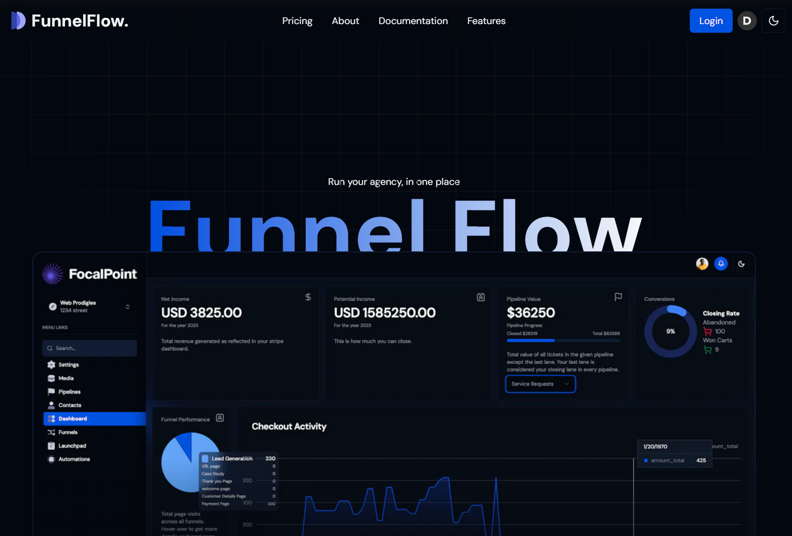

<div align = "center">

<h1><a href="https://github.com/sanurb/funnel-flow">funnel-flow</a></h1>

<a href="https://github.com/sanurb/funnel-flow/blob/main/LICENSE">
 </a>

<a href="https://github.com/sanurb/funnel-flow/graphs/contributors">
 </a>

<a href="https://github.com/sanurb/funnel-flow/stargazers">
</a>

<a href="https://github.com/sanurb/funnel-flow/network/members">
 </a>

<a href="https://github.com/sanurb/funnel-flow/watchers">
 </a>

<a href="https://github.com/sanurb/funnel-flow/pulse">
 </a>

<h3>FunnelFlow: Your Ultimate Business Toolkit  🎇🎉</h3>

<figure>
  
  <br/>
  <figcaption>funnel-flow in action</figcaption>
</figure>

</div>

FunnelFlow is a comprehensive platform that allows agencies and businesses to seamlessly build websites, manage projects, and optimize sales funnels with ease.
<!-- START doctoc generated TOC please keep comment here to allow auto update -->
<!-- DON'T EDIT THIS SECTION, INSTEAD RE-RUN doctoc TO UPDATE -->
## Table of Contents

- [✨ Features](#-features)
- [⚡ Setup](#-setup)
  - [⚙️ Requirements](#-requirements)
  - [💻 Installation](#-installation)
- [🚀 Usage](#-usage)
- [🏗️ What's Next](#-whats-next)
  - [✅ To-Do](#-to-do)
- [🧑‍💻 Behind The Code](#-behind-the-code)
  - [🌈 Inspiration](#-inspiration)
  - [💡 Challenges/Learnings](#-challengeslearnings)
- [🗃️ Database Schema](#-database-schema)

<!-- END doctoc generated TOC please keep comment here to allow auto update -->

## ✨ Features

- 🤯 **Multivendor B2B2B SaaS**: Manage multiple vendors and businesses seamlessly within a single platform.
- 🏢 **Agency and Sub Accounts**: Streamline the management of various clients and projects under one main account, with sub-account capabilities for team collaboration.
- 🌐 **Unlimited Funnel Hosting**: Host an unlimited number of sales funnels without capacity constraints, ensuring scalability.
- 🚀 **Full Website & Funnel Builder**: Intuitive drag-and-drop interface for creating stunning websites and high-converting sales funnels.
- 💻 **Role-Based Access**: Define user roles and permissions to ensure the right people have access to the right tools and information.
- 🔄 **Stripe Subscription Plans**: Simplify subscription management with seamless Stripe integration.
- 🛒 **Stripe Add-On Products**: Add and manage additional products with Stripe, enhancing your offerings.
- 🔐 **Connect Stripe Accounts for All Users (Stripe Connect)**: Facilitate easy Stripe account connections for all users, enabling streamlined payment processing.
- 💳 **Charge Application Fee per Sale and Recurring Sales**: Implement automated fee structures for transactions and recurring sales.
- 💰 **Custom Dashboards**: Create personalized dashboards that display the metrics and KPIs most relevant to your business.
- 📊 **Media Storage**: Securely store and manage all media assets used within the platform.
- 📈 **Stripe Product Sync**: Ensure consistency and accuracy by synchronizing product data with Stripe.
- 📌 **Custom Checkouts on Funnels**: Design and personalize processes of payment within your funnels to improve conversion rates.
- 📢 **Get Leads from Funnels**: Capture and manage leads generated through your sales funnels, driving business growth.
- 🎨 **Kanban Board**: Organize and manage tasks and projects efficiently with visual Kanban boards.
- 📂 **Project Management System**: Centralize project management with collaborative tools and tracking capabilities.
- 🔗 **Notifications**: Keep users informed with real-time notifications about important events and updates.
- 📆 **Funnel Performance Metrics**: Gain deep insights into the performance of your sales funnels with comprehensive metrics.
- 🧾 **Agency and Sub Account Metrics**: Monitor the performance of your agency and sub-accounts with detailed reporting.
- 🌙 **Graphs and Charts**: Visualize key data points and trends with integrated graphs and charts.
- ☀️ **Light & Dark Mode**: Offer a personalized visual experience with options for both light and dark themes.
- 📄 **Functioning Landing Page**: Create effective landing pages that convert visitors into customers.

## ⚡ Setup

### ⚙️ Requirements

- Node.js >= 14
- Bun
- Next.js
- Stripe account
- Clerk account
- Uploadthing account
- Tailwind CSS

### 💻 Installation

Installing FunnelFlow is as simple as cloning the repository and setting up your environment!

```bash
git clone https://github.com/sanurb/funnel-flow
cd funnel-flow
bun install
```

## 🚀 Usage

```bash
bun run dev
```

## 🏗️ What's Next

Planning to add advanced analytics and AI-driven insights to further optimize business processes.

### ✅ To-Do

- [x] Setup repo
- [x] Stripe Integration
- [ ] Add more components to the editor
- [ ] Enhance user onboarding experience

## 🧑‍💻 Behind The Code

### 🌈 Inspiration

The idea behind FunnelFlow came from the need to provide agencies and businesses with a comprehensive, all-in-one toolkit that simplifies their digital operations and enhances their efficiency.

### 💡 Challenges/Learnings

- Balancing feature richness with usability to ensure the platform remains intuitive.
- Integrating multiple third-party services like Stripe and Clerk seamlessly.
- Ensuring scalability and performance as the platform grows.

## 🗃️ Database Schema

The database schema for funnel-flow is designed to support a robust and scalable infrastructure, ensuring seamless data management and integration. You can view the complete schema here:

[View Database Schema](https://dbdocs.io/sanurb/SaaS_Funnel_Builder)

<hr>

<div align="center">

<strong>⭐ hit the star button if you found this useful ⭐</strong><br>

<a href="https://github.com/sanurb/funnel-flow">Source</a>
| <a href="https://linkedin.com/in/sanurb" target="_blank">LinkedIn </a>
| <a href="https://sanurb.github.io/projects" target="_blank">Other Projects </a>

</div>